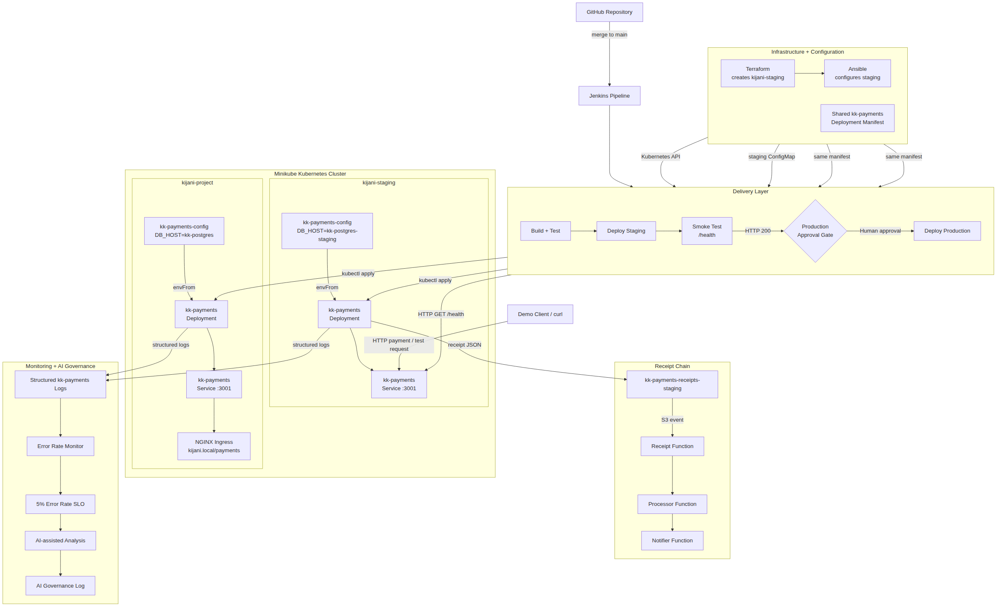

# KijaniKiosk DevOps Platform

## What is this?

KijaniKiosk is a DevOps engineering project demonstrating infrastructure
automation, CI/CD, secure application delivery, blue/green deployment,
health monitoring, and automated rollback.

The project evolves a simulated production platform through provisioning,
configuration management, artifact delivery, deployment automation, and
operational reliability practices. The current deployment architecture runs
blue and green versions of the KijaniKiosk API behind nginx, allowing releases
to be validated before receiving traffic and rolled back automatically when
post-deployment health checks fail.

## Architecture



The architecture uses a self-hosted GitHub Actions runner to deploy and
validate application releases. nginx provides blue/green traffic routing
between kk-api-blue on port 3000 and kk-api-green on port 3001, while
post-deployment monitoring can automatically trigger rollback when health
thresholds are breached.

The major components are:

- **GitHub Actions** — orchestrates deployment, traffic switching, and post-deployment monitoring.
- **Self-hosted runner** — executes deployment automation against the staging environment.
- **nginx** — routes live traffic to the currently active blue or green API environment.
- **kk-api-blue** — stable API deployment running on port `3000`.
- **kk-api-green** — candidate API deployment running on port `3001`.
- **switch-env.sh** — safely validates and switches nginx traffic between environments.
- **rollback.sh** — restores traffic to the previously active environment.
- **post-deploy-monitor.sh** — monitors application health after deployment and automatically triggers rollback when thresholds are exceeded.
- **Terraform and Ansible** — provide infrastructure and configuration-management automation developed during the project.
- **Jenkins/GitHub Actions pipelines** — demonstrate continuous integration and controlled application delivery.

## Documentation:

```markdown
- [Repository Secret Audit](docs/security-audit.md)

## Prerequisites

The following tools are required to reproduce or operate the environment:

- Git
- SSH/OpenSSH
- Bash
- curl
- nginx
- systemd
- Terraform
- Ansible
- GitHub CLI (`gh`)
- Node.js and npm for the kk-payments application
- Access to the staging infrastructure
- A GitHub repository with a configured self-hosted Actions runner

Sensitive credentials such as SSH private keys must be stored as GitHub
Actions secrets and must never be committed to the repository.

## Setup

Clone the repository:

```bash
git clone <repository-url>
cd kijanikiosk-devops

````markdown
Verify the repository:

```bash
git status